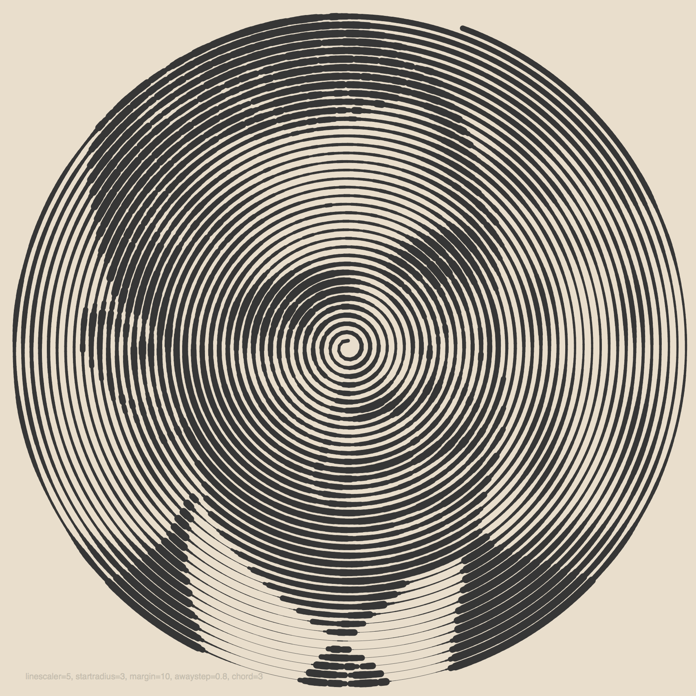

# Mellan

Claude Mellan (1598 to 1688) was a French artist and engraver, remembered today (if at all) for his virtuosic engravings, in which the image consists of a single spiral groove starting at the centre and winding outwards (like a vinyl record). The different tones are obtained by the slight swelling and shrinking of the line as it proceeds on its spiral outward course. Here's what Steve Jobs might have looked like in Mellan's hands:

Today's computers don't find these images difficult to produce, but the effect is pleasing. This Julia package will 'Mellanize' images and output a PDF file. I want to investigate laser-cutting an image this way one day...

# Requirements

Julia v0.3.

You also need the Luxor (a simple Cairo wrapper, also on my GitHub page), Color, and Images packages.

# Usage

    using Mellan

    mellanize("obama.jpg",
	    800,
	    linescaler      = 5,
	    foregroundcolor = Color.color("gray30"),
	    backgroundcolor = Color.color("antiquewhite2"),
	    startradius     = 5,
	    margin          = 10,
	    awaystep        = 1,
	    chord           = 4,
	    annotation      = true)

Use the `mellanize` function and supply a path name of an image and the required sidelength. The image should be square. The keyword parameters are all optional, but the ones of interest are:

-	linescaler

	a number between 0 and 5 or 10. The value of a pixel is multiplied by this number to give the width of the line. So with a value of 5, a 50% gray pixel is drawn with a width of 2.5 pixels.

- start radius

	the distance away from the centre. This shouldn't be zero, because the lines don't work when they're too close to the centre.

- awaystep

   this value determines the spacing of the groove.

- chord

	the length of each line. This is constant, although the line width changes.

- annotation

    add annotation at the bottom of the image showing current settings
